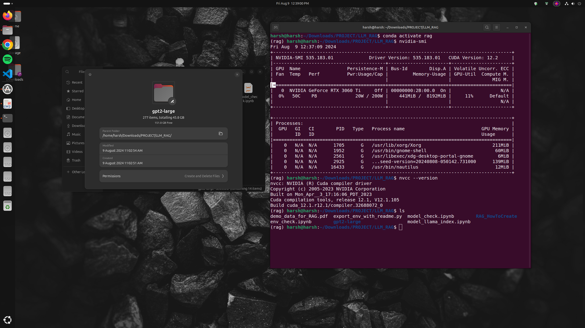

```markdown




# Retrieval-Augmented Generation (RAG) System Documentation

## Introduction

This documentation outlines the process of setting up a Retrieval-Augmented Generation (RAG) system using a locally stored GPT-2 model, FAISS for vector search, and LangChain for integrating retrieval and generation. The system is designed to retrieve relevant context from documents, including text extracted from a PDF, and generate concise answers to user queries.

## Table of Contents
- [Packages Installation](#packages-installation)
- [Model and Tokenizer Setup](#model-and-tokenizer-setup)
- [PDF Processing](#pdf-processing)
- [Document Store and FAISS Index](#document-store-and-faiss-index)
- [Retrieval Function](#retrieval-function)
- [Custom LLMChain Integration](#custom-llmchain-integration)
- [Running the RAG Pipeline](#running-the-rag-pipeline)
- [Troubleshooting and Adjustments](#troubleshooting-and-adjustments)

## Packages Installation

Before starting, you need to install several Python packages. Below is the list of packages and the commands to install them:

```bash
pip install transformers
pip install langchain
pip install faiss-cpu
pip install PyMuPDF
pip install sentence-transformers
```

### Summary of Installed Packages

- **transformers**: For loading the GPT-2 model and creating a text-generation pipeline.
- **langchain**: For integrating retrieval with language model generation.
- **faiss-cpu**: For efficient similarity search and clustering of dense vectors.
- **PyMuPDF**: For extracting text from PDF documents.
- **sentence-transformers**: For generating embeddings using pre-trained models.

## Model and Tokenizer Setup

The first step is to load the GPT-2 model and tokenizer from the local directory and set up a text-generation pipeline.

```python
from transformers import AutoModelForCausalLM, AutoTokenizer, pipeline

# Load the tokenizer and model from the local directory
model_name = "./gpt2-large"
tokenizer = AutoTokenizer.from_pretrained(model_name)
model = AutoModelForCausalLM.from_pretrained(model_name)

# Create a text-generation pipeline
pipe = pipeline("text-generation", model=model, tokenizer=tokenizer)
```

## PDF Processing

We use the PyMuPDF library to extract text from a PDF document, which will be included in our document store.

```python
import fitz  # PyMuPDF

def extract_text_from_pdf(pdf_path):
    doc = fitz.open(pdf_path)
    text = ""
    for page in doc:
        text += page.get_text()
    return text

# Extract text from the PDF document
pdf_path = "demo_data_for_RAG.pdf"
pdf_text = extract_text_from_pdf(pdf_path)
```

## Document Store and FAISS Index

With the extracted PDF text, along with other documents, we create a document store and build a FAISS index for efficient retrieval.

```python
from sentence_transformers import SentenceTransformer
import faiss
import numpy as np

# Initialize the SentenceTransformer model
embedding_model = SentenceTransformer('all-MiniLM-L6-v2')

# Create a list of documents including the PDF text
documents = [
    pdf_text,
    "The quick brown fox jumps over the lazy dog.",
    "Artificial Intelligence is transforming the world.",
    "LangChain provides a powerful interface for working with language models."
]

# Generate embeddings for each document
document_embeddings = embedding_model.encode(documents, convert_to_tensor=True).cpu().detach().numpy()

# Initialize FAISS index
index = faiss.IndexFlatL2(document_embeddings.shape[1])
index.add(document_embeddings)
```

## Retrieval Function

We define a function that retrieves the most relevant document based on a user query using the FAISS index.

```python
def retrieve_context(question):
    query_embedding = embedding_model.encode([question], convert_to_tensor=True).cpu().detach().numpy()
    distances, indices = index.search(query_embedding, 1)
    return documents[indices[0][0]]
```

## Custom LLMChain Integration

The retrieval function is integrated with a custom LLMChain class that formats the prompt and generates an answer using the GPT-2 model.

```python
from langchain.chains import LLMChain
from langchain.prompts import PromptTemplate

# Define a prompt template
template = """
Context: {context}

Question: {question}

Please provide a concise answer based on the context above.
Answer:"""
prompt = PromptTemplate(template=template)

# Define a custom LLMChain class
class CustomLLMChain:
    def __init__(self, pipeline, prompt):
        self.pipeline = pipeline
        self.prompt = prompt

    def __call__(self, inputs):
        context = retrieve_context(inputs["question"])
        prompt_input = {"context": context, "question": inputs["question"]}
        prompt_text = self.prompt.format(**prompt_input)
        output = self.pipeline(prompt_text, max_new_tokens=50)[0]['generated_text']
        return output.strip()
```

## Running the RAG Pipeline

With everything set up, you can now run the RAG pipeline to retrieve the relevant context and generate an answer.

```python
# Initialize the custom LLMChain
llm_chain = CustomLLMChain(pipeline=pipe, prompt=prompt)

# Define a sample query
question = "In which year did John do Software Engineering from Creative Solutions?"

# Generate and print the answer
result = llm_chain({"question": question})
print("Generated Answer:\n", result)
```

## Troubleshooting and Adjustments

### Issue: Model Generates Unwanted Additional Content

If the model generates more questions or content than expected, you can adjust the `max_new_tokens` parameter or post-process the output to limit the generation.

### Issue: Tensor Conversion Errors

When generating embeddings, ensure that tensors are moved to the CPU before converting them to NumPy arrays by using `.cpu()` and `.detach()`.

### Adjusting the Prompt Template

If the model's output is not specific enough, refine the prompt template to be more direct and limit the scope of the generated text.

```python
template = """
Context: {context}

Question: {question}

Please provide a concise answer based on the context above.
Answer:"""
```

## Step-by-Step Installation for Environment

### Create and Activate Conda Environment

First, create a new conda environment named `pytorch` with Python 3.9:

```sh
conda create --name RAG python=3.9
```

Activate the newly created environment:

```sh
conda activate RAG
```

### Install PyTorch

Install PyTorch along with torchvision and torchaudio using pip and specify the CUDA version you want to use. In this example, we are using CUDA 12.1:

```sh
pip3 install torch torchvision torchaudio --index-url https://download.pytorch.org/whl/cu121
```

### Verify Installation

To verify that PyTorch is installed correctly and CUDA is enabled, run the following Python commands:

```python
import torch
print(torch.__version__)
print(torch.cuda.is_available())
```

If CUDA is available, it should return `True`.

```sh
pip install accelerate
pip install --upgrade jupyter ipywidgets
pip install transformers
```

To download the GPT-2 Large model directly to your current working directory (`~/Downloads/PROJECT/LLM_RAG`), you can follow these steps:

### Download the GPT-2 Large Model [DID NOT WORK FOR ME]

Run the following command in your terminal while you are in the `~/Downloads/PROJECT/LLM_RAG` directory:

```bash
huggingface-cli download gpt2-large --cache-dir ./ --all
```

This command will download the GPT-2 Large model files directly into the current directory (`~/Downloads/PROJECT/LLM_RAG`).


### Use `git lfs` to Clone the Model Repository [WORKED FOR ME]

To download the model files, you can use `git lfs` to clone the repository directly into your directory.

1. **Install `git lfs` if not already installed:**

   ```bash
   sudo apt-get install git-lfs
   git lfs install
   ```

2. **Clone the GPT-2 Large model repository: [277 items, totalling 45.8 GB Disk Space]**

   Navigate to your desired directory:

   ```bash
   cd ~/Downloads/PROJECT/LLM_RAG
   ```

   Then clone the repository:

   ```bash
   git lfs clone https://huggingface.co/gpt2-large
   ```

## Conclusion

This documentation provides a detailed guide to setting up a RAG system using GPT-2, FAISS, and LangChain. By following these steps, you can create a system that retrieves relevant context from documents and generates concise answers to user queries.
